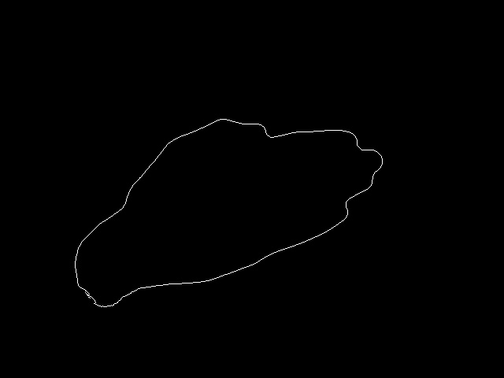
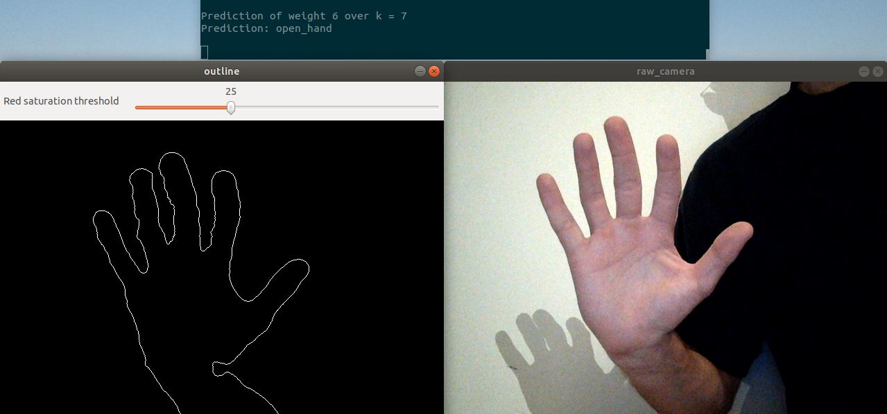

# Hand Gesture Recognition

The goal of this project is to predict if a hand gesture is "open hand", "fist", "left hand" or "right hand". It was used for my student ROS project to move a Khepera mobile robot according to hand gestures.

This project uses Fourier descriptors (see [below](#fourier-descriptors) to compute the important information of a gesture from an image, and KNN to classify the gestures.

## Getting Started

These instructions will get you a copy of the project up and running on your local machine for development and testing purposes.

### Prerequisites

This project works on a Linux system.

In order to compile the project, you will need:
- C++17
- [Boost library](https://www.boost.org/)
- [OpenCV](https://opencv.org/)

You will also need a dataset of hand gestures. You can find my dataset on [Zenodo](https://zenodo.org/record/3271625#.XSUw7CYRUQO).

### Installing

Firt, get the source code:
```
git clone https://github.com/alexandremgo/hand-gesture-recognition
```

Then you install the project as follow:
```
mkdir -p hand-gesture-recognition/build
cd hand-gesture-recognition/build
cmake ..
make
```

Finally you put the dataset (you can find mine [here](https://zenodo.org/record/3271625#.XSUw7CYRUQO). Download the 5 zip files) in the dataset folder:
```
cd where_you_downloaded_zip_files
mv raw_*.zip path_this_project/dataset/ 
cd path_this_project/dataset/
unzip "raw_*.zip"
```

You will see 5 other folders in the dataset folder: open_hand, fist, left_hand, right_hand and negative. Keep those folders: that's where the preprocess images will go after executing TODO example.

## Running examples 

Go to:

```
cd build/examples
```

### Test your camera

You can test your camera and display the biggest found outline on the images from your camera using the example `camera_detection`.

You will also be able to find your value for the `outline_threshold` using this example.
The `outline_threshold` is a value used during the search of the gesture outline on each image. You can put 25 for [this dataset](https://zenodo.org/record/3271625#.XSUw7CYRUQO).

To run it:
```
./camera_detection camera_id
```

On linux you can find your camera by doing (it's probably 0)

```
ls -ltrh /dev/video*
```

### Pre-processing the images

In order to use the KNN model, you need to pre-process the images in the dataset. To do so:

```
 ./preprocess_dataset outline_threshold
```

The `outline_threshold` is the same variable than the one [above](#test-your-camera)

This will save the outline in a binary image for each image: 



You can see that for some images in each category, some outlines were not found during this pre-process.

### Predict the hand gesture with a KNN on 1 image

To use the KNN model on 1 particular image, run:

```
./knn_image_predictionpath_to_image_to_predict
```

### Predict hand gestures with a KNN using a webcam

You can try to predict hand gestures directly coming from your webcam:



To use your webcam and the KNN model, run:

```
./knn_camera_prediction camera_id
```

With `camera_id` the same as [this section](#test-your-camera).

## Fourier descriptors

Fourier descriptors permit to represent a closed shapes independently of its rotation, scaling and location. 

The Fourier descriptors have been computed using this [article](http://sirien.metz.supelec.fr/spip.php?article77) of Jean-Luc Collette.

In a nutshell: let's take a discrete representation of a closed shapes: a list of N points (x_m, y_m). We can create a complex sequence: z_m = x_m + i.y_m from this list. Then we can find a [Fourier decomposition](https://en.wikipedia.org/wiki/Fourier_series) of this sequence by supposing this sequence is [periodic](https://en.wikipedia.org/wiki/Periodic_sequence) with period N. 
Finaly, we only keep the most significant coefficients of this Fourier serie, and they will become the Fourier descriptors after different normalization steps.


